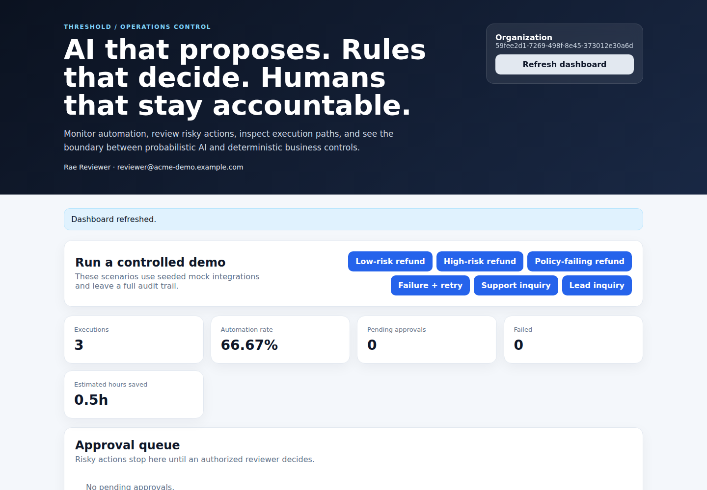
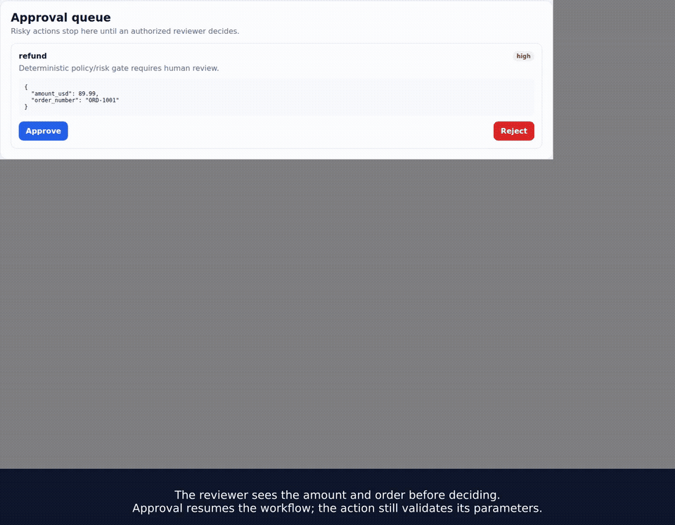
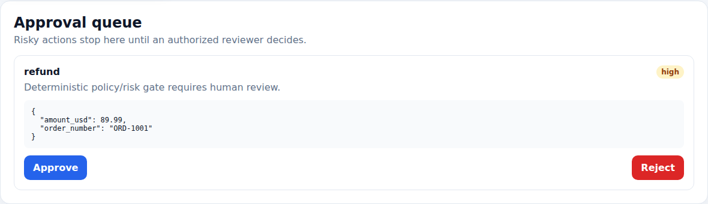
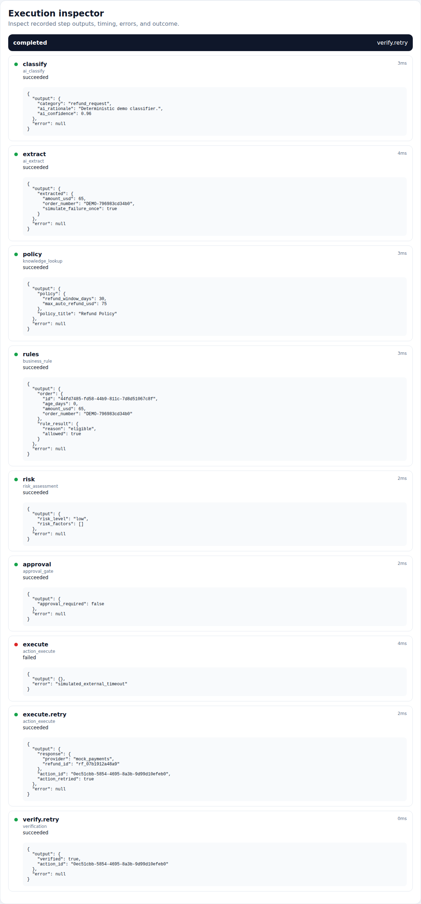
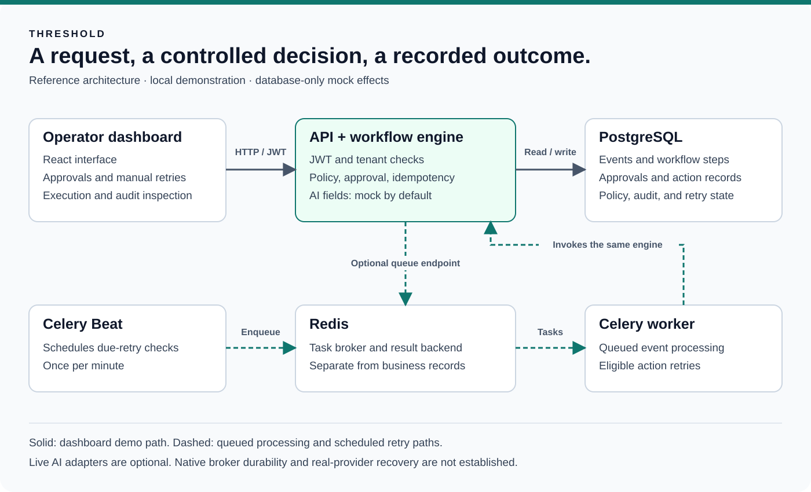

# Threshold

**Stack:** FastAPI · React · PostgreSQL · Redis/Celery · Playwright

Threshold is a full-stack operations prototype for **controlled business automation**. The reference workflow accepts refund requests, extracts structured data, applies deterministic policy, pauses risky actions for human approval, and records execution and recovery evidence.

No real payments or emails are sent in the demo.



**Portfolio note:** Threshold was already being developed locally before this portfolio repository was published. The history here begins with the import and later deployment-hardening work, not the project's first implementation.

## What this project demonstrates

- **FastAPI + React** application with PostgreSQL-backed workflow state.
- A deliberately narrow AI boundary for classification and extraction.
- Deterministic policy and risk checks before business actions.
- Human approval for actions that exceed configured limits.
- Tenant-scoped access and reviewer-only decision/retry operations.
- Idempotency, retry scheduling, circuit breaking, dead-letter handling, and audit records.
- Celery/Redis worker paths, database migrations, regression tests, and AI-boundary evaluation.

The key design choice is simple: **AI can propose structured facts; ordinary code decides whether an action is allowed.**

## Verified demo

The repository contains media generated by an automated Playwright run against the real Docker Compose application—not a mockup.



The capture verifies:

1. a low-risk refund completes automatically;
2. a higher-value refund pauses for human approval;
3. the reviewer identity is recorded when approval resumes execution;
4. an injected action failure remains visible;
5. retry succeeds while preserving the same business-action identity.

| Approval required | Retry and recovery |
| --- | --- |
|  |  |

See the machine-readable [capture evidence](docs/assets/demo/capture-evidence.json), [demo guide](docs/DEMO.md), and [verification notes](docs/VERIFICATION.md).

## Architecture



```text
React dashboard
      |
      v
FastAPI API
      |
      v
Workflow engine
   /      \
policy    AI extraction/classification
   \      /
      v
PostgreSQL
      |
      +--> approvals / audit / retries

Optional queued execution: Redis + Celery
```

The reference refund path keeps eligibility rules and thresholds in deterministic code. AI-provider adapters are optional; the default demo uses a deterministic mock provider.

## Run locally

Requires Docker with Compose.

```bash
cp .env.example .env
docker compose up -d --build
docker compose exec backend alembic upgrade head
docker compose exec backend python -m scripts.seed_demo_org
```

Open **http://localhost:5173**.

Demo accounts:

```text
owner@acme-demo.example.com     / demo1234
reviewer@acme-demo.example.com  / demo1234
```

Try **Low-risk refund**, **High-risk refund**, **Policy-failing refund**, and **Failure + retry**.

API documentation is available at **http://localhost:8000/docs**. The API exposes `/health` for process health and `/ready` for database readiness.

## Verify

```bash
make test
make lint
make eval
make frontend-build
```

CI covers the frontend production build, backend lint/migrations/tests, AI-boundary evaluation, and the separate M8 staging runtime regression suite.

The UI capture workflow additionally boots PostgreSQL, Redis, FastAPI, nginx, and the production React build, then drives the application through real browser interactions before publishing the verified screenshots and GIF above.

## Repository map

| Path | Purpose |
| --- | --- |
| `backend/app/api/` | Authentication, operations, decisions, and demo routes |
| `backend/app/workflows/` | Workflow engine and deterministic primitives |
| `backend/app/ai/` | AI-provider boundary and prompt resolution |
| `backend/app/models/` | SQLAlchemy models |
| `backend/app/workers/` | Celery ingestion and retry tasks |
| `backend/tests/` | API and workflow regression tests |
| `frontend/` | React operator dashboard |
| `deploy/m8/` | Frozen staging runtime plus explicit compatibility overlays |
| `docs/` | Architecture, reliability, security, API, and verification notes |

## Scope

Threshold is a prototype and engineering case study, not a production payment service.

Current boundaries include:

- refund/payment and notification effects are mocked;
- the reference approval/retry continuation is not a generic workflow language;
- Redis durability and external exactly-once delivery are not guaranteed;
- live model behavior depends on provider credentials and configuration;
- the demo does not establish production-scale concurrency, immutable auditing, or payment-ledger correctness;
- the M8 deployment directory is a staging snapshot with explicit compatibility overlays; canonical development remains in the normal application source.

For deeper technical detail:

[Architecture](docs/ARCHITECTURE.md) ·
[Reliability](docs/RELIABILITY.md) ·
[Security](docs/SECURITY.md) ·
[API](docs/API.md) ·
[Verification](docs/VERIFICATION.md)

MIT license; see [LICENSE](LICENSE).
