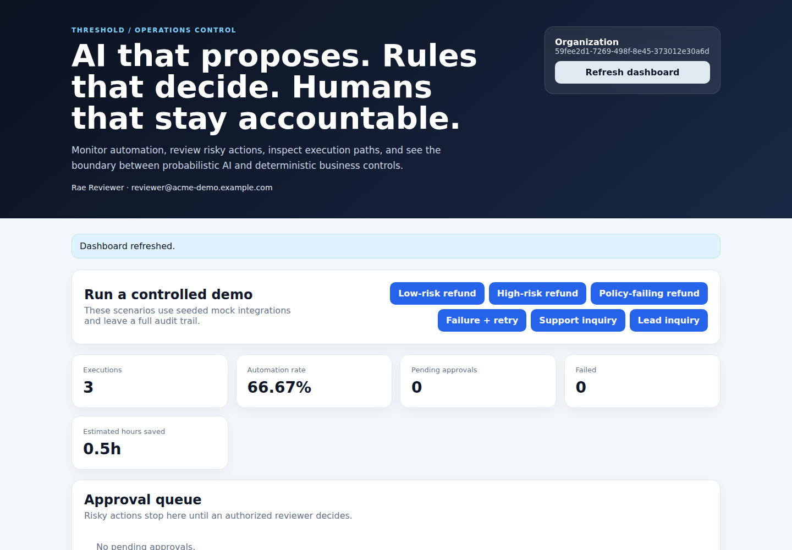
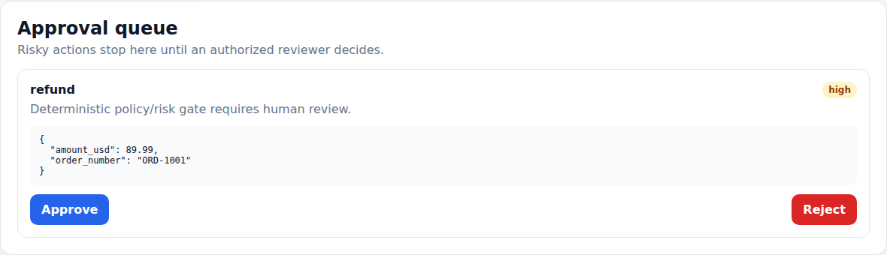
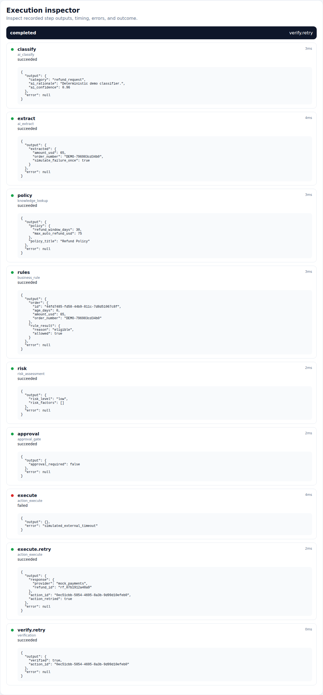
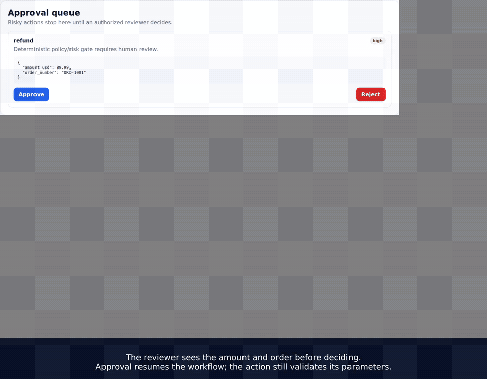

# Threshold

Refund review and recovery with Python, FastAPI, PostgreSQL, and a React dashboard.

Threshold takes a refund request, extracts an order and amount, checks policy, and
either records a mock refund or pauses for an authorized reviewer. Operators can
inspect step inputs and outputs, approve or reject requests, and investigate failed
actions. The local demo uses fictional retail data; no real money moves or email is sent.

## Demo



| Human review | Failure and recovery |
| --- | --- |
|  |  |



These captures were recorded against the real Docker Compose application on
**2026-09-19**, using the mock provider. They show an earlier dashboard version;
the current source uses React Router and TanStack Query with dedicated workspace,
integration, approval, recovery, and billing pages.
Recovery in the recording was triggered manually, with Worker and Beat stopped.
[Capture evidence](docs/assets/demo/capture-evidence.json) records the source commit
and execution IDs. The repository includes screenshots and a GIF; a permanent
full-video link has not been published.

[Three-minute walkthrough](docs/DEMO.md) · [Business case](docs/CASE_STUDY.md) ·
[Architecture](docs/ARCHITECTURE.md) · [Verification evidence](docs/VERIFICATION.md)

## What it demonstrates

- **Policy before execution:** order, remaining refundable amount, refund window,
  and automatic approval limit are checked in Python. Model confidence does not
  authorize a refund. The current rule output reports `eligible`, `policy_failed`,
  or `order_not_found`; it does not enumerate every failed policy condition.
- **Human review:** tenant-scoped approvals and decisions restricted to reviewers,
  admins, and owners. Approval does not bypass order and amount validation.
- **Inspectable execution:** persisted steps, errors, action attempts, and audit records.
- **Duplicate handling:** separate event keys and canonical order/amount refund keys.
- **Recovery:** scheduled retries, circuit state, dead-letter records, and explicit
  reconciliation for ambiguous provider outcomes.
- **A narrow AI boundary:** classification and structured extraction, with a
  deterministic mock provider by default and optional OpenAI/Anthropic adapters.

Customer, lead, support, and invoice workflows are smaller classify-and-notify
examples. Notifications are database records; these examples do not update a CRM
or deliver email. The optional [n8n/HubSpot bridge](START_HERE_N8N.md) updates
an existing ticket after a verified refund completion or rejection. It uses
signed intake and a transactional outcome outbox; templates are imported inactive.

## Run locally

Requires Docker with Compose. From the repository root, copy the example environment
only on first setup; preserve an existing `.env`.

```bash
cp .env.example .env
docker compose up -d --build
docker compose exec backend alembic upgrade head
docker compose exec backend python -m scripts.seed_demo_org
```

On Windows PowerShell, use `Copy-Item .env.example .env` for the first command.
The remaining Docker commands are the same. With Make installed, the equivalents
are `make up`, `make migrate`, and `make seed`.

Open **http://localhost:5173** and sign in with either public local-demo account:

| Role | Email | Password |
| --- | --- | --- |
| Owner | `owner@acme-demo.example.com` | `demo1234` |
| Reviewer | `reviewer@acme-demo.example.com` | `demo1234` |

Use a disposable demo database. Existing demo users and older refund keys are not
automatically migrated by the seed script. API documentation is at
http://localhost:8000/docs; `/health` checks the API process and `/ready` checks
database reachability.

Open **Scenarios** and run **Low-risk refund**, **High-risk refund**, and **Provider failure**. The seeded
policy has a $75 automatic limit and a 30-day window. Old seeded orders can age out
of that window. The failure scenario creates a fresh mock order and injects one
timeout; use Retry for immediate recovery or allow Beat to schedule it. Repeated
ordinary demos can reuse a successful refund action while retaining separate events.

`docker compose down` stops the stack and keeps its named PostgreSQL volume.
See the [demo guide](docs/DEMO.md) for rejection and recording instructions.

## Verification

Local Compose builds `backend/Dockerfile.dev`, which includes test and lint tools.
Production Compose uses the runtime-only image.

```bash
make test             # PostgreSQL-backed API/workflow regression suite
make lint             # Ruff
make eval             # deterministic classification/extraction fixtures
make frontend-build   # npm ci, TypeScript check, and Vite build; Node.js 22.12+ required
```

For database-free primitive tests, install `backend/requirements-dev.txt` in a
Python 3.12+ virtual environment and run `make unit-test`.

**Evidence checked on 2026-10-01:** [CI at commit `12bf94a`](https://github.com/mark-owa/threshold/actions/runs/36611807246)
passed backend lint, migrations, PostgreSQL-backed tests, dependency audits,
deterministic evaluation, frontend build, and production Compose syntax validation.
The later [run at `99d6d03`](https://github.com/mark-owa/threshold/actions/runs/36797036742)
passed tests, migrations, frontend checks, and Compose validation but failed the
Python dependency audit. Its AI evaluation step was skipped after that failure.
An earlier green run does not establish that current dependencies pass an audit.

The imported dashboard now runs `tsc --noEmit` before Vite, and CI adds backend
Mypy and the n8n template harness. Local import checks passed the frontend build,
backend lint/type checks, 68 unit/HTTP tests, and deterministic evaluation. The
[candidate import CI](https://github.com/mark-owa/threshold/actions/runs/36803688853)
also applied all nine migrations and passed 162 PostgreSQL-backed tests with
72.29% coverage. Its Python audit still failed on the same PyJWT findings. CI does
not build the separate M8 staging image. These checks do not prove live payment
behavior or worker crash recovery. [Testing](docs/TESTING.md) explains the checks;
[verification](docs/VERIFICATION.md) records results and remaining gaps.

## Architecture and extended scope


The diagram illustrates the local demo. FastAPI and SQLAlchemy persist workflow
state in PostgreSQL; Redis/Celery provide queued work and periodic tasks. React
provides the operator interface.

The broader source also includes workspaces and roles, signed webhook intake,
transactional outbox records, worker leases, Shopify/Stripe/generic REST provider
adapters, trials, usage metering, and a live-execution switch. Those features are
private-beta scaffolding. They are not established customer deployments or verified
production payment infrastructure. The demo workspace always selects mock payments.

[Architecture](docs/ARCHITECTURE.md) separates demo and provider paths.
[Reliability](docs/RELIABILITY.md) explains retry and reconciliation boundaries.
[Staging milestones](docs/STAGING_MILESTONES.md) retain historical deployment reports;
[Milestone 8](docs/SAAS_MILESTONE_8.md) describes the beta gate and required proof.

## Source map

| Path | Responsibility |
| --- | --- |
| `backend/app/api/` | Authentication, tenants, approvals, operations, billing, webhooks, and demo routes |
| `backend/app/workflows/engine.py` | Workflow steps, refund policy, approval continuation, action execution, retries, and reconciliation |
| `backend/app/workflows/primitives.py` | Deterministic normalization, mock classification/extraction, and retry delays |
| `backend/app/ai/` | Model providers and prompt resolution |
| `backend/app/integrations/` | Refund providers and Shopify order integration |
| `backend/app/services/`, `backend/app/workers/` | Outbox, usage/readiness services, delivery, and recovery tasks |
| `backend/app/models/`, `backend/alembic/` | SQLAlchemy models and schema migrations |
| `backend/tests/`, `backend/evals/` | Regression tests and deterministic evaluation data |
| `frontend/` | React dashboard; [source layout](frontend/README.md) |
| `integrations/n8n/`, `scripts/check_n8n_templates.cjs` | Inactive CRM bridge templates and their local structure/JavaScript checks |
| `deploy/m8/` | Historical staging runtime and overlays; separate from the imported canonical source |
| `docs/` | Design, operational boundaries, and verification history |

## Limitations

- The business case is simulated. No customer success, revenue, or measured savings
  are claimed. The dashboard's hours-saved metric assumes 15 minutes per automatically
  completed workflow.
- Approval continuation and retries target the reference refund flow, rather than
  arbitrary workflow definitions. Most orchestration still resides in `engine.py`.
- Order-level refunded totals are not a complete payment ledger or proof of safe
  concurrent partial refunds. Customer/order ownership verification needs further work.
- Refresh tokens, API-key issuance, automatic approval expiry, and immutable audit
  storage are not implemented. Dashboard tokens are held in per-tab `sessionStorage`.
- Redis-backed rate limiting fails open during Redis outages. The demo queue has no
  Redis persistence configuration; queued demo requests lost before database intake
  need resubmission. Persisted webhook intake uses a separate outbox path.
- Live AI accuracy, actual provider account flows, high-load concurrency, and complete
  interruption/restore drills need separate evidence. The M8 archive and overlays also
  need consolidation with canonical source.

Development used AI assistance. Repository history includes source imports and later
maintenance; it does not record every original implementation step. Earlier review
reports and their limits are summarized in [History](docs/HISTORY.md).

MIT license; see [LICENSE](LICENSE).
