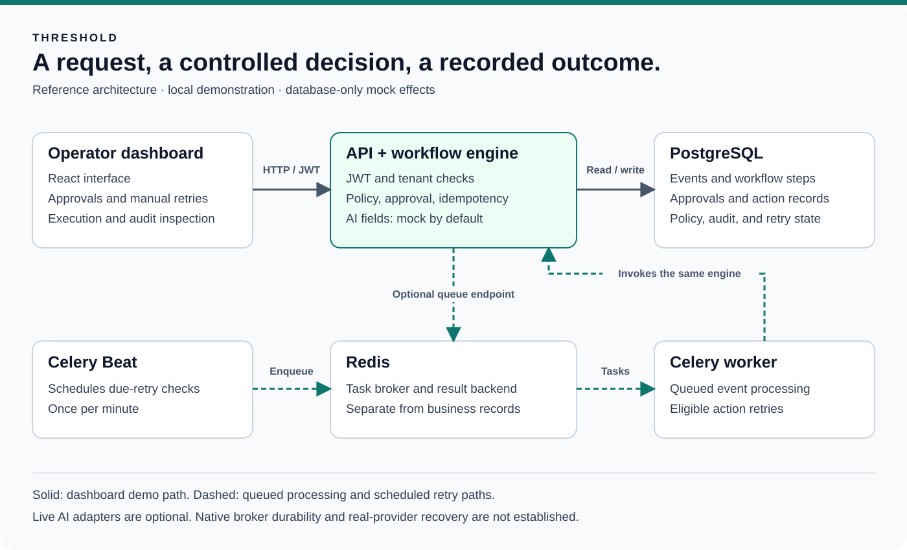

# Threshold

Threshold is a refund-handling workflow you can run locally: a FastAPI backend and a
React operator dashboard. It takes a refund request, extracts the order and amount,
checks deterministic policy, and either records a mock refund or pauses for human
review. In the demo, no real money moves and no email is sent.

Every decision is inspectable: each step's input, output, timing, and failure is
persisted, and a paused request shows *which* policy rules it failed.

## The business problem

A refund request involves more than extracting a number from a message. Someone has to
check the order, apply policy, decide when a human should look at it, and understand
what happened when processing fails. Threshold makes those decisions and outcomes
visible in one place.

The reference case is a fictional retail operation. It demonstrates an approach to
controlled automation; it is not a customer deployment or evidence of measured savings.



**Start here:** [Business case](docs/CASE_STUDY.md) ·
[Three-minute demo guide](docs/DEMO.md) · [Architecture](docs/ARCHITECTURE.md)

The demo guide walks through the actual dashboard. Screenshots and a recorded
walkthrough are not yet included; the diagram above is an architecture illustration.

## What the demo shows

- Ordered workflow steps with persisted inputs, outputs, timing, and failures.
- A narrow AI boundary: classification and structured extraction only, with a
  deterministic mock provider by default (OpenAI and Anthropic adapters are optional).
- Refund eligibility and amount thresholds kept in ordinary Python and policy data,
  not in a model. A failed check reports the specific rules that tripped
  (for example `outside_refund_window`, `amount_exceeds_refundable_balance`).
- Authenticated, tenant-scoped inspection. Approve, reject, and retry are limited to
  reviewers, admins, and owners; viewers are read-only.
- Duplicate-event handling, canonical refund keys, scheduled retries, a circuit
  breaker, and dead-letter records.
- PostgreSQL migrations, regression tests, structured request logs, and a small
  labeled evaluation dataset.

Customer, lead, support, and invoice inquiries use smaller classify-and-notify
workflows. Notifications are local database records; those flows do not implement
CRM updates, lead qualification, or a helpdesk integration.

## Run locally

Requires Docker with Compose and Make. From the repository root:

```bash
cp .env.example .env
make up
make migrate
make seed
```

Open the dashboard at **http://localhost:5173** and sign in with:

- `owner@acme-demo.example.com` / `demo1234`
- `reviewer@acme-demo.example.com` / `demo1234`

These are public demo credentials for local use. Use a fresh disposable demo database;
older demo logins and refund keys are not data-migrated. API documentation is at
http://localhost:8000/docs. `/health` checks the API process; `/ready` checks the
database connection. `make seed-history` adds examples across all five categories.

Try **Low-risk refund**, **High-risk refund**, and **Failure + retry**. A
**Policy-failing refund** enters the approval queue; use Reject to demonstrate
cancellation. A reviewer may override the automatic policy gate, but the action
still requires an existing order and a positive amount no greater than its total.
Missing amounts require review and modification; they are never inferred as zero.

Failure + retry creates a fresh mock order so an earlier successful refund cannot
hide the simulated timeout. It records a failed workflow and a scheduled action;
use Retry for immediate recovery or let Celery Beat check due actions each minute.
Repeated ordinary demos reuse an existing successful refund for the same order and
amount, while retaining a separate event/execution record.

### API example

Log in first and copy the returned `access_token` into `TOKEN`:

```bash
curl -s http://localhost:8000/api/v1/auth/login \
  -H 'Content-Type: application/json' \
  -d '{"email":"owner@acme-demo.example.com","password":"demo1234"}'

TOKEN='<returned access_token>'
curl -s http://localhost:8000/api/v1/demo/orgs/acme-demo/events \
  -H "Authorization: Bearer $TOKEN" \
  -H 'Content-Type: application/json' \
  -d '{"idempotency_key":"example-001","payload":{"text":"Refund order #ORD-1002 for $65.00"}}'
```

### Windows / PowerShell without Make

With Docker Desktop running, open PowerShell in the repository root:

```powershell
Copy-Item .env.example .env
docker compose up -d --build
docker compose exec backend alembic upgrade head
docker compose exec backend python -m scripts.seed_demo_org
```

Copy the example only on first setup; preserve an existing `.env`. The same dashboard
URL and demo logins apply.

## Verify

```bash
make test             # PostgreSQL-backed API and workflow tests
make lint             # Ruff checks
make eval             # deterministic classification/extraction evaluation
make frontend-build   # requires local Node.js 22.12+ and npm
```

For just the primitive tests without Docker (Python 3.12+):

```bash
python -m venv .venv
# Activate .venv using your shell's activation command.
python -m pip install -r backend/requirements-dev.txt
make unit-test
```

**Verification status, plainly:** a CI workflow is defined (lint, migrations, tests
with a coverage floor, dependency audits, frontend build), but no successful hosted
run is recorded for this repository yet, and earlier reported test results came from a
PostgreSQL-compatible emulator rather than the full Docker stack. Run `make test`
yourself before relying on any of it. [TESTING](docs/TESTING.md) covers test
isolation and what each check does and does not establish;
[VERIFICATION](docs/VERIFICATION.md) records what has been re-checked and when.

The backend image includes development tools because this Compose setup is a local
demo environment. `make down` stops containers; PostgreSQL data remains in its named
volume.

## Beyond the demo: the multi-tenant layer

The reference workflow sits on top of a tenant-aware platform layer, built to explore
what it takes to move from "works in a demo" toward "safe to point at real merchants."
It is **private-beta scaffolding, not a production service**, and none of it is needed
to run or evaluate the refund demo above.

- **Workspaces and access control:** organizations, role-based permissions
  (owner/admin/reviewer/viewer), team invitations, tenant-scoped data.
- **Durable execution:** a transactional outbox, worker leases with stale-work
  recovery, and an `UNKNOWN` state for ambiguous provider outcomes that requires
  reconciliation instead of a blind retry (to avoid double refunds).
- **Integrations:** Shopify and Stripe adapters and a configurable generic REST
  refund provider, with signed webhooks and credential-by-reference.
- **Commercial scaffolding:** trials, plan entitlements, usage metering, and Stripe
  Checkout/Portal handoff.
- **Safety gates:** live provider execution is off by default for non-demo workspaces
  and is enabled only through a beta-readiness gate, with an owner/admin kill switch
  that the durable worker also enforces.

The demo workspace always uses the mock provider. What has and has not been proven
for this layer (real Shopify/Stripe connections, a secret-vault lifecycle, restore
drills, failure injection) is spelled out in
[SaaS Milestone 8](docs/SAAS_MILESTONE_8.md); the build history is in
[SaaS build](docs/SAAS_BUILD.md) and the `SAAS_MILESTONE_*` docs.

## Repository map

| Path | Purpose |
|---|---|
| `backend/app/api/` | Auth, operations, approvals, workspace, billing, webhook, and demo routes |
| `backend/app/workflows/` | Workflow engine (`engine.py`), generic step handlers (`steps.py`), refund eligibility rules (`refund_rules.py`), and deterministic primitives |
| `backend/app/ai/` | Provider adapters and prompt resolution |
| `backend/app/integrations/` | Shopify, Stripe, and generic REST refund providers |
| `backend/app/services/` | Outbox, entitlements/usage, and beta-readiness checks |
| `backend/app/core/` | Config, security, middleware, and webhook signing |
| `backend/app/models/` | SQLAlchemy models |
| `backend/app/workers/` | Celery ingestion, delivery, and recovery tasks |
| `backend/alembic/` | Database migrations |
| `backend/scripts/`, `backend/evals/` | Demo fixtures and evaluation data |
| `backend/tests/` | Unit and API/workflow regression tests |
| `frontend/` | React operator dashboard; see [`frontend/README.md`](frontend/README.md) for the source layout |
| `docs/` | Architecture, API, decisions, security, and limitations |

## Scope and limitations

This is a portfolio project, not a production payment or automation service.

- The demo's actions and notifications are mocks. Threshold is not a payment ledger.
- Approval resume and action retry target the reference refund workflow. They are
  not a generic continuation engine for arbitrary workflow definitions, and the
  refund rules are deliberately isolated in one module rather than presented as
  general-purpose.
- Not implemented: refresh tokens, API-key issuance, automatic approval expiry, and
  immutable audit storage. Access tokens are short-lived and held in memory by the
  dashboard.
- Rate limiting is Redis-backed and deliberately fails open if Redis is unavailable,
  so a cache outage is not a total outage; monitor Redis and readiness accordingly.
- Ingestion is serialized per organization for simple duplicate handling. High-load
  concurrency is not established.
- Redis queue persistence is not guaranteed by the demo Compose configuration.
  Requests lost before database processing need resubmission.
- Live model calls need credentials and a provider-compatible model configuration.
  The small mock evaluations do not establish accuracy on real customer requests.
- "Hours saved" in the dashboard assumes 15 minutes per automatically completed
  workflow; it is illustrative.

[Architecture](docs/ARCHITECTURE.md) · [API](docs/API.md) ·
[Reliability](docs/RELIABILITY.md) · [Security](docs/SECURITY.md)

## Related freelance work

This project is relevant to scoped Python backend work: validating incoming records,
connecting an internal dashboard to an API, implementing approval steps, and debugging
duplicate processing or failed automation. Its provider boundary also illustrates how
structured extraction can feed deterministic rules.

A real payment, CRM, or email integration would be a separate implementation with its
own authentication, delivery, and verification requirements.

Need help with a similar internal process? In your enquiry, include the current
workflow, a redacted sample input, the expected result, and what should require
human approval.

MIT license; see [LICENSE](LICENSE).
