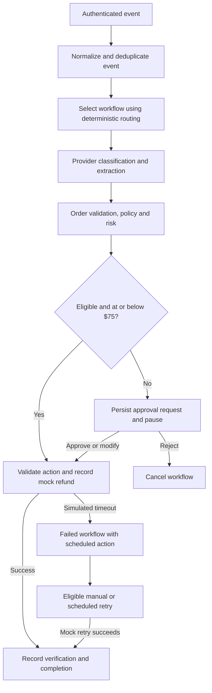

# Architecture

The implemented system is a synchronous FastAPI/SQLAlchemy application backed by
PostgreSQL. Celery offers a queued ingestion path and periodic action retries;
the dashboard also uses synchronous routes for immediate demo results.

The dashboard's scenario buttons use the synchronous API path. The optional queue
endpoint publishes to Redis; a Celery worker calls the same workflow engine. Celery
Beat schedules a task every minute to look for due action retries. Business records
are stored in PostgreSQL. These components are present in the Compose configuration;
their presence does not establish crash-safe delivery.

## Refund control flow

The $75 threshold is the seeded policy, not a universal constant. This diagram
shows the reference demo path. Invalid provider output can fail before an action
exists; exhausted attempts and circuit/disabled-integration gates are described in
[RELIABILITY](RELIABILITY.md). Reviewer approval may override automatic eligibility,
but it cannot bypass action validation. Retry uses the existing action row.

## Execution flow

1. Normalize the event, validate its source, and check the organization's event key.
2. Use deterministic classification to select the latest active matching workflow,
   preferring the organization's definition over a global template.
3. Walk the definition's ordered steps using `WorkflowEngine._run_step`.
4. Persist step results and AI usage. A failed step stops the workflow and preserves
   the context accumulated before that failure.
5. An approval gate pauses the refund workflow. A reviewer decision either cancels
   it or invokes the existing refund execution and verification path.

Routing happens before the provider classification step. The provider's output
therefore does not dynamically switch the selected workflow. Invalid provider
outputs fail the step; there is no automatic fallback to a human queue.

## Refund decisions

Extraction proposes an order number and amount. The rule step checks a completed
order, a nonnegative order age within the refund window, and a positive amount in
whole cents no larger than the order total. Missing amounts fail automatic
eligibility. Eligible amounts at or below the configured automatic limit proceed;
other requests require review. AI confidence is recorded, not used to authorize.

The action boundary validates order existence, tenant scope, and amount even after
human modification. A reviewer can override the automatic eligibility policy but
cannot approve an absent order, a negative amount, or an amount above the order total.

## Persistence and scope

Workflow, event, action, and audit rows live in PostgreSQL. Event keys are unique
per organization, execution rows are unique per event, and refund action keys
include organization, order, and canonical two-decimal amount. Ingestion takes an
organization row lock to keep simultaneous duplicate event submissions simple.

Steps run in the request/task transaction. This is adequate for database-only mock
side effects; it is not an outbox or an external-payment transaction protocol.
Approval and retry continuations are specific to the refund reference workflow.
Existing schema fields for future integrations remain, without adding handlers.

The frontend preserves a single React component with local state and fetch calls.
Authentication is an in-memory bearer token; nginx proxies the Docker dashboard's
API requests. See README limitations and [RELIABILITY](RELIABILITY.md).
