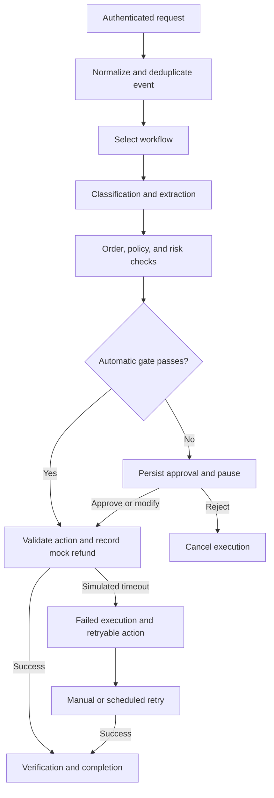
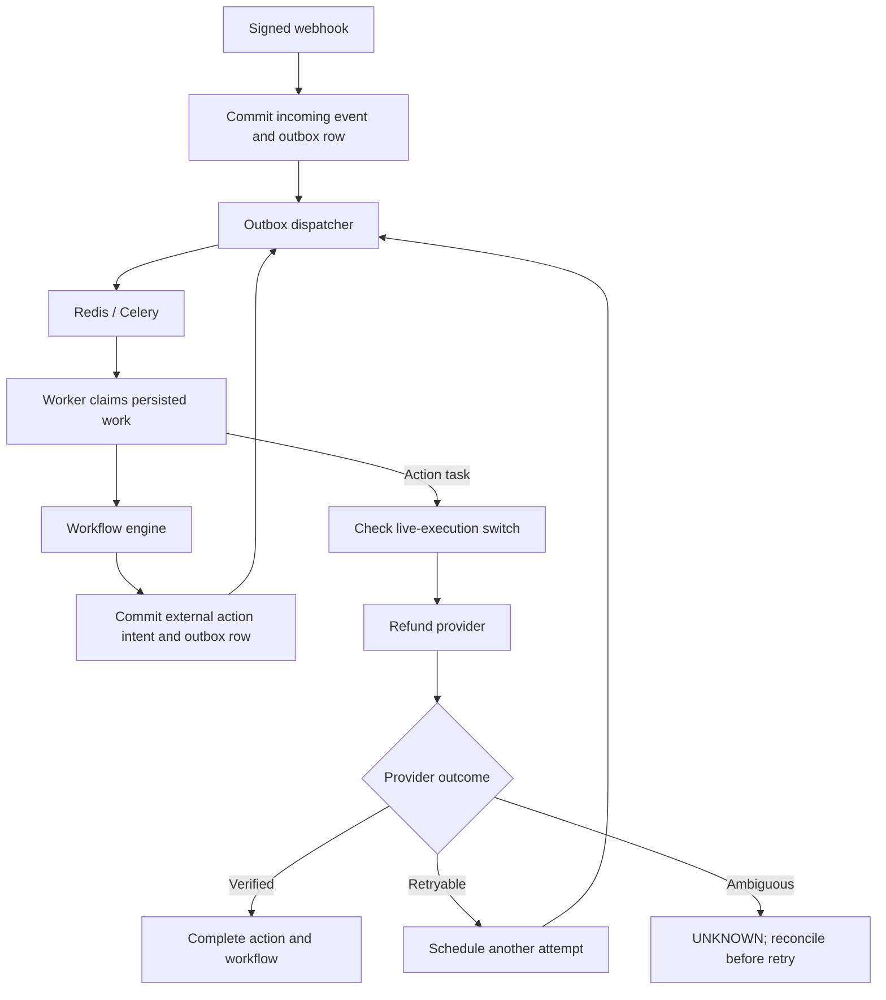

# Architecture

Threshold has an immediate local demo path and a persisted webhook/provider path.
Both use FastAPI, synchronous SQLAlchemy, PostgreSQL records, and the same workflow
engine. Redis/Celery provide queue delivery and periodic recovery tasks.

The illustration describes the local demo. The broader source also includes
transactional outbox records and provider workers, described below.

## Local refund flow

```mermaid
flowchart TD
    R["Authenticated request"] --> E["Normalize and deduplicate event"]
    E --> W["Select workflow"]
    W --> X["Classification and extraction"]
    X --> P["Order, policy, and risk checks"]
    P --> G{"Automatic gate passes?"}
    G -->|Yes| A["Validate action and record mock refund"]
    G -->|No| H["Persist approval and pause"]
    H -->|Approve or modify| A
    H -->|Reject| C["Cancel execution"]
    A -->|Success| V["Verification and completion"]
    A -->|Simulated timeout| F["Failed execution and retryable action"]
    F --> T["Manual or scheduled retry"]
    T -->|Success| V
```

The seeded automatic limit is $75 and the refund window is 30 days.
Dashboard scenario buttons use synchronous demo routes. The queued demo endpoint
instead sends a Celery task before database intake; it does not provide the same
durability boundary as persisted webhook intake.

## Workflow and policy

The engine selects a workflow with deterministic routing before running its provider
classification step. Provider classification does not dynamically replace the
selected workflow. Ordered steps persist inputs, outputs, latency, errors, and AI usage.

Extraction proposes an order and amount. Policy checks order existence, completed
status, age, positive whole-cent amounts, and the remaining refundable balance.
Current rule results report `eligible`, `policy_failed`, or `order_not_found`.
A failed policy is not broken down into individual conditions.

Eligible requests within the automatic amount limit proceed. Other requests pause
for review after successful extraction. Invalid model output may fail before an
approval exists. Reviewer approval can override automatic policy eligibility, but
action validation still checks the tenant order and refundable amount.

## Persisted intake and external actions

```mermaid
flowchart TD
    H["Signed webhook"] --> I["Commit incoming event and outbox row"]
    I --> D["Outbox dispatcher"]
    D --> Q["Redis / Celery"]
    Q --> W["Worker claims persisted work"]
    W --> E["Workflow engine"]
    E --> A["Commit external action intent and outbox row"]
    A --> D
    W -->|Action task| G["Check live-execution switch"]
    G --> P["Refund provider"]
    P --> R{"Provider outcome"}
    R -->|Verified| S["Complete action and workflow"]
    R -->|Retryable| T["Schedule another attempt"]
    T --> D
    R -->|Ambiguous| U["UNKNOWN; reconcile before retry"]
```

Webhook handlers persist the event and its outbox record in one database transaction.
The dispatcher publishes committed records and tracks publication leases. Workers
process persisted events or action intents, with stale-work recovery tasks.

Non-demo action creation queues an intent instead of treating a provider call as
part of the HTTP/database transaction. The action worker checks the organization's
live-execution setting before calling the provider. Provider results distinguish
verified success, retryable failure, permanent failure, and unknown outcomes.

Source includes reconciliation and recovery mechanisms; their presence does not
prove exactly-once effects or complete crash recovery. Manual retry uses
`retry_failed_execution`, which calls the configured provider directly in canonical
source. This differs from the archived M8 description of worker-based live manual
retry; test and consolidate those paths before live use.

## Source boundaries

| Source | Responsibility |
| --- | --- |
| `backend/app/workflows/engine.py` | Step handlers, policy, approval continuation, action execution, retry, and reconciliation |
| `backend/app/workflows/primitives.py` | Deterministic normalization, mock extraction/classification, and delays |
| `backend/app/api/webhooks.py` | Signed intake and persisted event/outbox creation |
| `backend/app/services/outbox.py` | Outbox records and stale publication leases |
| `backend/app/workers/tasks.py` | Delivery, action tasks, dispatch, and recovery |
| `backend/app/integrations/` | Provider adapters and Shopify order integration |
| `frontend/src/` | Application shell, API/types, workspace data/actions, and view components |

There are no committed `steps.py` or `refund_rules.py` modules. Orchestration
remains concentrated in `engine.py`.

## Persistence and deployment boundaries

Events, executions, approvals, actions, attempts, outbox messages, and audit rows
live in PostgreSQL. Event keys are organization-scoped; action keys include the
organization, order, and canonical two-decimal amount. These keys are not a complete
payment ledger or an external-provider transaction.

The frontend stores its bearer token in memory. nginx proxies Docker dashboard API
requests. `deploy/m8/` separately packages a frozen runtime archive with compatibility
overlays; current CI checks canonical source and does not build that image.

See [RELIABILITY](RELIABILITY.md), [SECURITY](SECURITY.md), and
[VERIFICATION](VERIFICATION.md) for operational behavior and proof limits.
