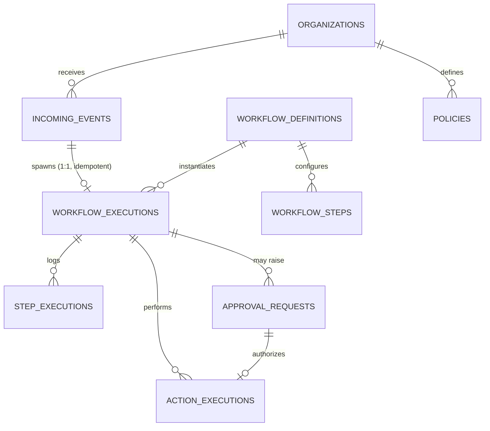

# Database Schema

PostgreSQL, SQLAlchemy 2.0 declarative models, Alembic migrations. Twenty tables,
grouped by concern below. Full column-level detail is in
`backend/app/models/*.py` (each file is short and commented); this document is the
map, not a duplicate of the code.

Two schema-wide conventions, explained fully in `docs/DECISIONS.md`:
- **Primary keys** are client-generated UUIDs (`app/models/base.py::UUIDPKMixin`).
- **Enum columns** are stored as `VARCHAR` with the Python enum's `.value` (not
  its `.name`) via `app/models/base.py::enum_column()` — avoids native-Postgres-ENUM
  migration friction (`ALTER TYPE ... ADD VALUE`) as workflow categories grow.

## Tenancy & auth

| Table | Purpose |
|---|---|
| `organizations` | A tenant. Every business-data table hangs off `organization_id`. |
| `users` | Login identity. Not tenant-scoped — one user can belong to multiple orgs. |
| `organization_members` | Join table carrying the org-scoped role (owner / admin / reviewer / viewer). |
| `api_keys` | Reserved model for API-key credentials; no issuance or webhook route exists. |

## Ingestion

| Table | Purpose |
|---|---|
| `incoming_events` | Stored raw input and processing metadata. Unique per `(organization_id, idempotency_key)`; database-enforced immutability is not implemented. |

## Workflow engine

| Table | Purpose |
|---|---|
| `workflow_definitions` | A configurable workflow "type" (e.g. `refund_request`, v1). `organization_id` nullable = global template vs. org-specific customization. |
| `workflow_steps` | Ordered, configured steps within a definition. `step_type` selects the engine branch; `config` is handler-specific JSON. |
| `workflow_executions` | One run of a definition against one event. Unique on `incoming_event_id` — the workflow-level idempotency guarantee. |
| `step_executions` | One step's run within an execution — input, output, timing, errors. This is what the execution detail page renders. |

## Human-in-the-loop

| Table | Purpose |
|---|---|
| `approval_requests` | Everything a reviewer needs: proposed action, reason, AI confidence, risk level + factors, source context, generated parameters, and — once decided — reviewer, decision, any modification, and the final execution result. |

## Actions & integrations

| Table | Purpose |
|---|---|
| `integration_configs` | Per-org, per-provider settings. Non-secret only; demo providers are mocks with no real credentials at all. |
| `action_executions` | One attempt (and its retries) at a mock side effect. Unique `idempotency_key` — the action-level idempotency guarantee, independent of the event/execution-level ones above. |

## Audit

| Table | Purpose |
|---|---|
| `audit_log_entries` | Application-appended event records. Step details live in `step_executions`; database immutability is not enforced. |

## AI governance

| Table | Purpose |
|---|---|
| `prompt_templates` | Versioned prompts resolved by key and optional version. Code-defined defaults in `app/ai/prompts.py` are used when no active database row matches. |
| `ai_usage_logs` | One row per LLM call — tokens, cost, latency. What the dashboard's cost figures are summed from. |

## Mock business world

These tables form the local mock business data. The current engine queries them
directly; implementing real external integrations would require code changes.

| Table | Purpose |
|---|---|
| `customers` | Demo org's customers. |
| `orders` | Demo org's orders — what refund-request workflows validate against. |
| `policies` | The deterministic knowledge source: human-readable `content` (usable as bounded AI context) plus `structured_rules` JSON (what the business-rule engine actually evaluates). |
| `leads` | Seeded sample leads; no CRM-writing workflow is implemented. |
| `notifications_log` | Local mock notification records. There is no email/Slack delivery worker or transactional outbox protocol. |

## Entity relationships (core flow)



## Migrations

Managed with Alembic (`backend/alembic/`). The initial migration defines the initial tables; a second migration adds circuit state. Generate a new one
after changing any model:

```bash
make revision m="describe the change"
make migrate
```
