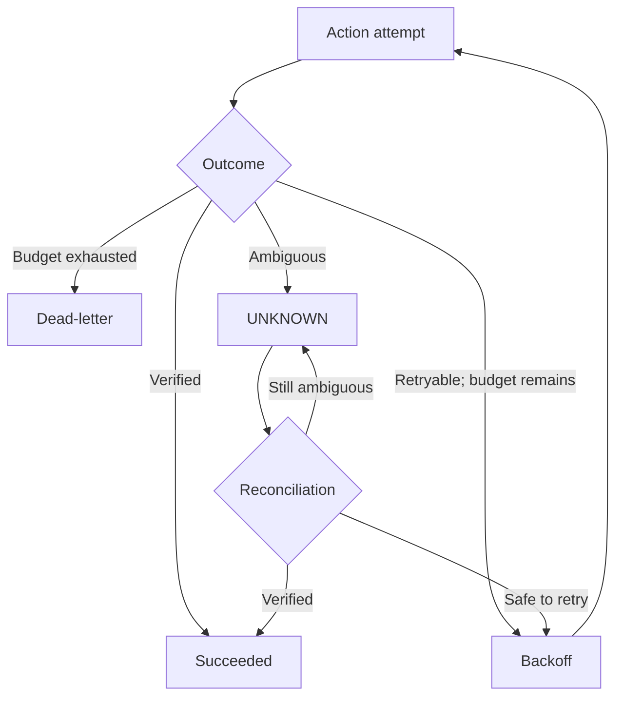

# Reliability model

The local demo demonstrates duplicate handling and recovery with mock payments.
The broader source includes persisted webhook intake, an outbox, action leases,
provider adapters, and reconciliation. Implemented mechanisms and verified runtime
guarantees are kept separate.

## Failure behavior

| Condition | Behavior | Limit |
| --- | --- | --- |
| Repeated event key in one organization | Reuses the existing event/execution. | Different keys represent different requests. |
| Same successful order/amount action | Reuses the canonical action result when action validation allows it. | A canonical key is not a cumulative refund ledger or external exactly-once proof. |
| Missing amount or failed policy | Requires review after successful extraction. | Malformed provider output can fail before an approval/action exists. |
| One-time demo timeout | Records a failed execution and retry schedule. | Mock failure, not an actual payment-provider outage. |
| Retryable provider outcome | Schedules another attempt within the budget. | Transport and provider behavior require separate integration evidence. |
| Ambiguous provider outcome | Marks the action `UNKNOWN`; ordinary retry is rejected pending reconciliation. | Reconciliation itself needs provider-specific test evidence. |
| Attempt budget exhausted | Marks the action dead-letter and clears its schedule. | Operator investigation is required. |
| Integration disabled or circuit open | Blocks action execution; forced retry does not bypass these gates. | A failure before action creation may need a new event. |
| Worker lease expires | Stale action recovery marks ambiguity for reconciliation; stale event recovery handles recoverable intake states. | A committed running workflow cannot always be safely reconstructed. |
| Broker publication fails | Persisted outbox records support later publication attempts. | The legacy demo queue publishes before database intake and can lose unpersisted work. |

## Retry and reconciliation

The demo schedules `threshold.retry_due_actions` once per minute. Backoff makes an
action eligible; scheduler timing is not a wall-clock guarantee. Delays are bounded,
and the reference action has a three-attempt budget including the initial attempt.

Manual retry locks the failed execution, checks action state, budget, integration,
and circuit status, then invokes the configured provider. The canonical implementation
does not automatically send this manual path through the action outbox. Automatic
external-action recovery and new non-demo action intents use the durable worker path.

The action key is retained across attempts. A verified result completes the action;
an unknown result has no ordinary retry schedule. Reconciliation queries the
provider and updates state rather than blindly repeating an ambiguous side effect.

## Outbox and worker recovery

Webhook intake commits its incoming event and outbox record together.
The dispatcher claims publication work with a lease, sends a Celery task, and
records publication success or failure. Publication can be repeated around a crash;
database keys and worker state checks are therefore needed in addition to the outbox.

Non-demo actions persist an intent and require the live-execution switch at creation
and again in the action worker. Recovery tasks inspect stale actions and events.
These mechanisms cannot make a database and an external payment provider one atomic
transaction or guarantee immutable audit persistence during a database outage.

## What has been verified

Hosted CI exercises regression cases against PostgreSQL and mocked provider
boundaries. The committed September demo captures show manual mock recovery.
They do not establish broker delivery or worker restart recovery.

Historical M8 staging reports include Redis-interruption observations, but several
provider and duplicate-delivery exit criteria remain incomplete. M8 uses a frozen
runtime plus build overlays and can differ from canonical source. See
[VERIFICATION](VERIFICATION.md) and [STAGING_MILESTONES](STAGING_MILESTONES.md).

Before live use, test timeout-after-provider-commit, duplicate delivery, worker loss,
outbox failure, and reconciliation together against disposable test infrastructure.
